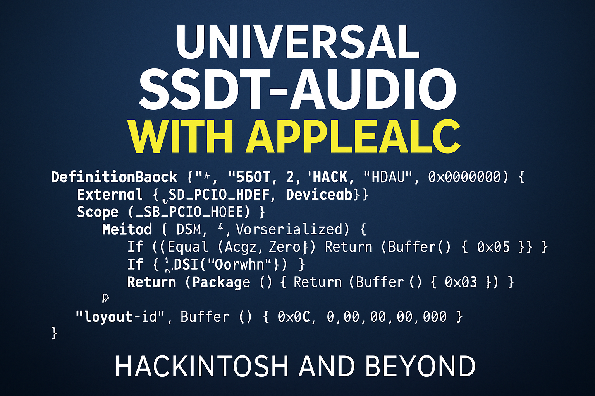
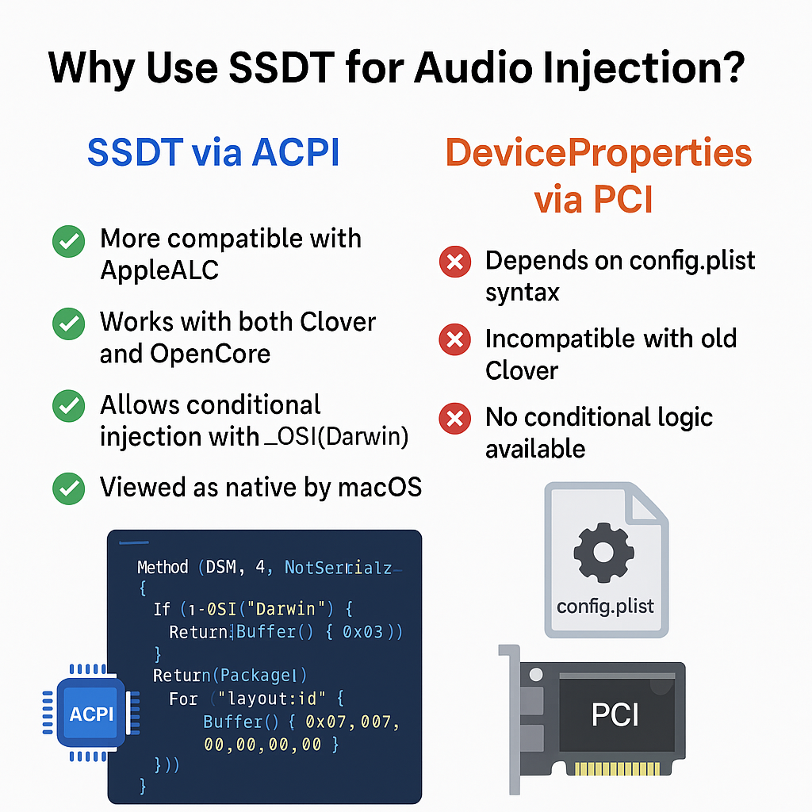
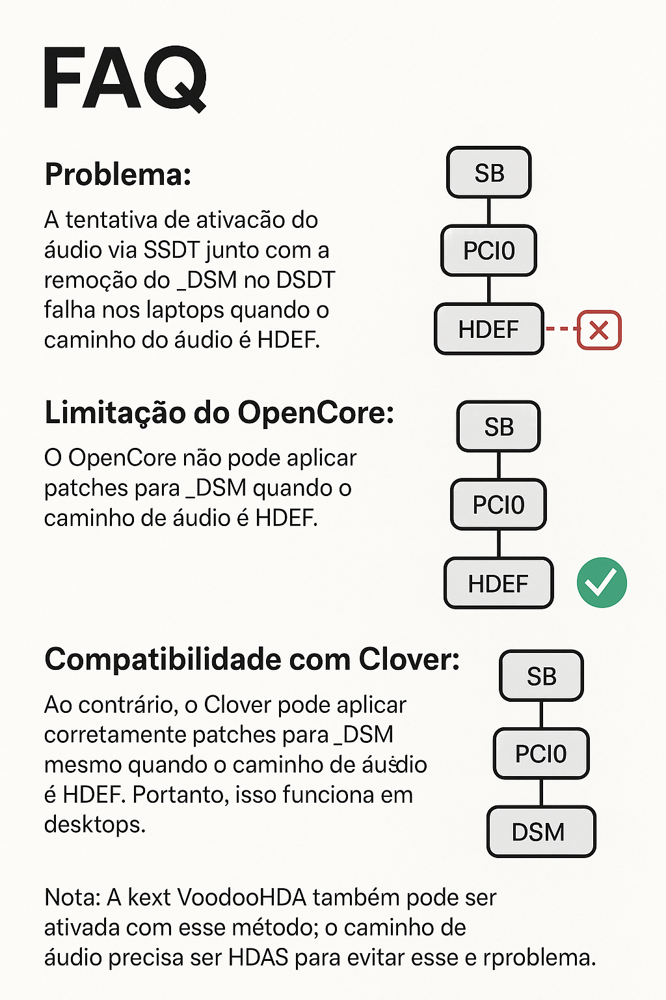
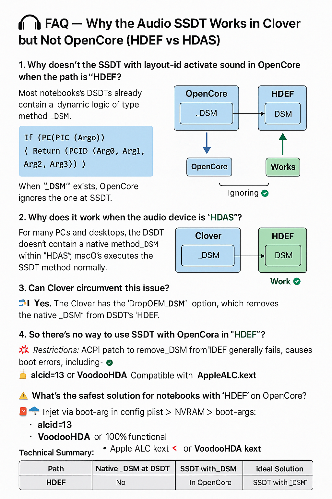

# SSDT-Audio-Universal

Universal SSDT template for injecting `layout-id` via ACPI.



---

## :brazil: Instruções em Português

**SSDT-Audio - Modelo Universal para AppleALC**

Este SSDT permite injetar o `layout-id` de áudio diretamente via ACPI, substituindo o uso de `DeviceProperties` no `config.plist`.

### Como usar
1. Abra o DSDT da sua máquina e descubra o caminho do áudio (ex: `_SB.PC00.HDAS` ou `_SB.PCI0.HDEF`)
2. Edite o arquivo `SSDT-Audio.dsl` e ajuste:
   - O caminho no `External()` e `Scope()`
   - O `layout-id` correto (ex: `0x07` = 7, `0x0C` = 12)
3. Compile com:
   ```bash
   iasl SSDT-Audio.dsl
   ```
4. Copie `SSDT-Audio.aml` para `EFI/OC/ACPI` (ou `CLOVER/ACPI/patched`)
5. Ative no `config.plist` → **ACPI → Add** (se usar OpenCore)

🎯 Use Hackintool ou IORegistryExplorer para verificar se a injeção foi aplicada.



---

## :us: Instructions in English

**SSDT-Audio - Universal Template for AppleALC**

This SSDT injects the audio `layout-id` directly via ACPI, replacing the need for `DeviceProperties` in the `config.plist`.

### How to use
1. Open your machine's DSDT and find the audio path (e.g. `_SB.PC00.HDAS` or `_SB.PCI0.HDEF`)
2. Edit the `SSDT-Audio.dsl` file and adjust:
   - The path in `External()` and `Scope()`
   - The correct `layout-id` (e.g. `0x07` = 7, `0x0C` = 12)
3. Compile with:
   ```bash
   iasl SSDT-Audio.dsl
   ```
4. Copy the resulting `SSDT-Audio.aml` to `EFI/OC/ACPI` (or `CLOVER/ACPI/patched`)
5. Enable it in `config.plist` → **ACPI → Add** (if using OpenCore)

🎯 Tip: Use Hackintool or IORegistryExplorer to verify if the injection was applied.

---

### Infographics



---

Created by: Hackintosh and Beyond

## License
This project is licensed under the [MIT License](LICENSE).
